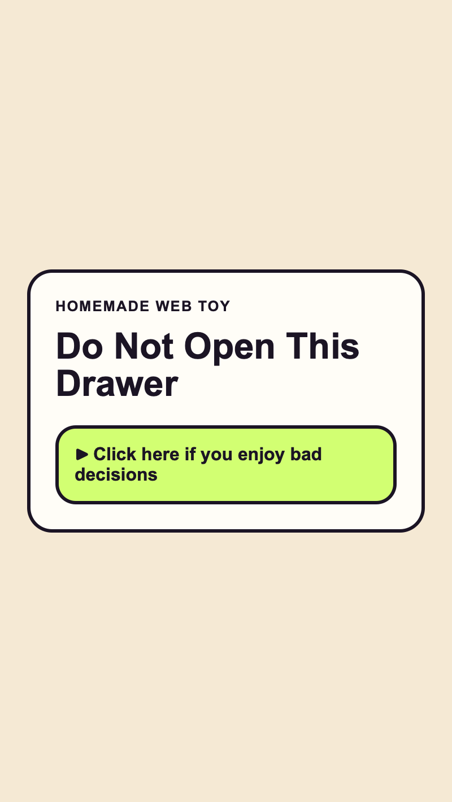

<h2 class="c-project-heading--task">Add the cursed file header</h2>

Add the visible header inside `<main class="page">` so the page stops looking empty.

<h2 class="c-project-heading--explainer">Make this change</h2>

The starter file has an empty `<main>` element, so add the eyebrow, the filename heading, and the mood line inside it.

These tags build the visible header for the fake file. The class names give `style.css` separate hooks for the eyebrow line and the mood label later.

--- code ---
---
language: html
filename: index.html
line_numbers: true
line_number_start: 1
line_highlights: 10-12
---
<html lang="en">
  <head>
    <meta charset="utf-8">
    <meta name="viewport" content="width=device-width, initial-scale=1">
    <title>DO NOT OPEN_final_FINAL2.html</title>
    <link rel="stylesheet" href="style.css">
  </head>
  <body>
    <main class="page">
      
Recovered profile artefact // last updated 2:13am

      <h1>DO NOT OPEN_final_FINAL2.html</h1>
      
mood: banned from the computer room

    </main>
  </body>
</html>
--- /code ---

## Now run your code

You should see the recovered profile text at the top of the page instead of an empty panel.

  

