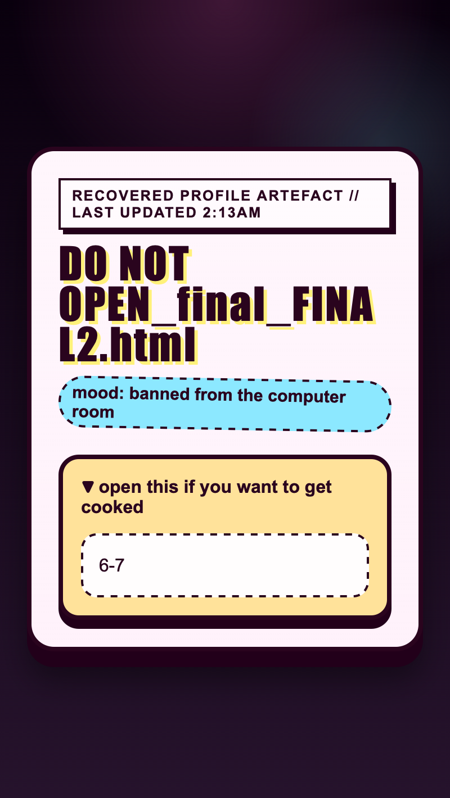

<h2 class="c-project-heading--task">Add the drawer HTML</h2>

Add the drawer underneath the header so the page has something dramatic to open.

<h2 class="c-project-heading--explainer">Make this change</h2>

Add a `
` element with a clickable `
` and a hidden `<section class="inside">`.

`
` makes a built-in open-and-close widget with no JavaScript. The `
` is the part people click, and everything else inside stays hidden until it opens.

--- code ---
---
language: html
filename: index.html
line_numbers: true
line_number_start: 9
line_highlights: 14-19
---
    <main class="page">
      
Recovered profile artefact // last updated 2:13am

      <h1>DO NOT OPEN_final_FINAL2.html</h1>
      
mood: banned from the computer room

      

        
open this if you want to get cooked

        <section class="inside">
          
6-7

        </section>
      

    </main>
--- /code ---

## Now run your code

Open the drawer and you should see the new warning on the tab and `6-7` inside.

  

