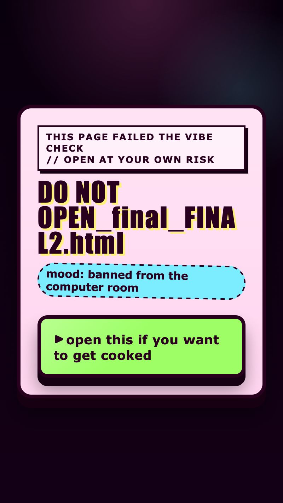

<h2 class="c-project-heading--task">Build the warning tab</h2>

Add one clickable drawer so the file can open and close without any JavaScript.

<h2 class="c-project-heading--explainer">Make this change</h2>

`
` makes a built-in open-and-close widget with no JavaScript. `
` is the part people click on the front.

--- code ---
---
language: html
filename: index.html
line_numbers: true
line_number_start: 9
line_highlights: 14-16
---
    <main class="page">
      
THIS PAGE FAILED THE VIBE CHECK // OPEN AT YOUR OWN RISK

      <h1>DO NOT OPEN_final_FINAL2.html</h1>
      
mood: banned from the computer room

      

        
open this if you want to get cooked

      

    </main>
--- /code ---

## Now run your code

The page should now have a chunky warning tab that you can click open and closed, even though the inside is still missing.

  

