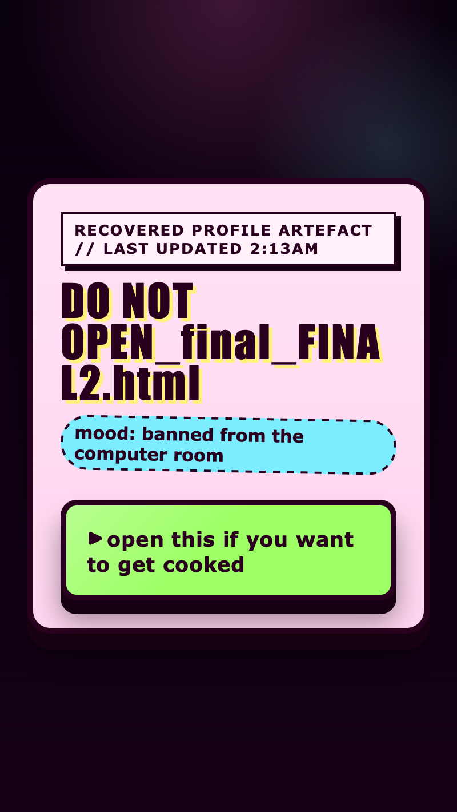

<h2 class="c-project-heading--task">Give it terminally bad taste</h2>

Change the custom properties at the top of `style.css` so the page gets darker, louder, and more glittery in the worst possible way.

<h2 class="c-project-heading--explainer">Make this change</h2>

Open `style.css` and edit the values inside `:root`. These custom properties control the background colours, the bright panel colours, the border size, the font, and the width of the widget.

<h3>Tip</h3>

Pick colours that feel like a dodgy profile theme, a fake warning sticker, or a file that should never have been uploaded.

Small value changes can make the whole page feel more sugary, more dramatic, or more suspicious.

`--drawer-bg` could be slime green, sticker pink, or sickly orange.

`--drawer-open-bg` could be warning yellow, bright peach, or fake highlighter green.

`--inside-bg` works well as dirty white, pale peach, or washed-out cyan.

<a href="https://www.google.com/search?q=web+colour+picker" target="_blank" rel="noopener noreferrer">Open the Google web colour picker in a new tab</a> if you want help choosing colours.

These custom properties store the main colours, sizes, and font choices for the whole page. Changing them here updates lots of the design without rewriting every rule below.

--- code ---
---
language: css
filename: style.css
line_numbers: true
line_number_start: 1
line_highlights: 2-14
---
/* Change these values to give the page terminally bad taste. */
:root {
  --page-bg: #140016;
  --ink: #29001d;
  --panel-bg: #ffd5ef;
  --drawer-bg: #9dff65;
  --drawer-open-bg: #ffe45e;
  --inside-bg: #fff7fe;
  --accent: #7cecff;
  --shadow-color: #170011;
  --border-size: 5px;
  --corner-size: 14px;
  --body-font: Verdana, Geneva, sans-serif;
  --drawer-width: 34rem;
}
--- /code ---

## Now run your code

The page should still open and close the same way, but now it should look more like a cursed profile skin.

  

