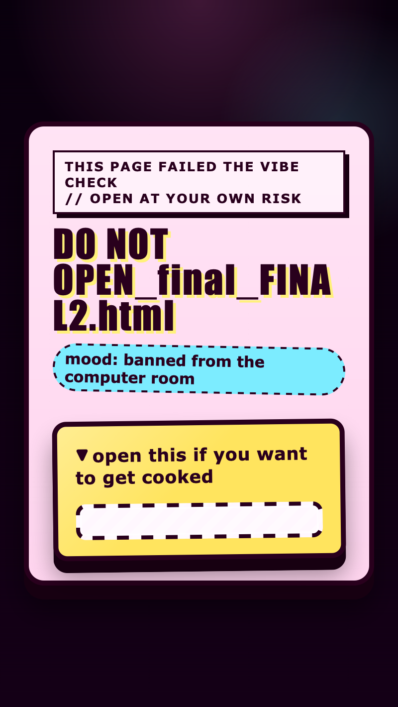

<h2 class="c-project-heading--task">Add the hidden panel</h2>

Add the inside box that appears when the artefact opens.

<h2 class="c-project-heading--explainer">Make this change</h2>

Put the hidden `<section>` inside the drawer. The CSS for `.inside` is already in `style.css`, so the panel will appear as soon as you add the HTML.

--- code ---
---
language: html
filename: index.html
line_numbers: true
line_number_start: 9
line_highlights: 16-17
---
    <main class="page">
      
THIS PAGE FAILED THE VIBE CHECK // OPEN AT YOUR OWN RISK

      <h1>DO NOT OPEN_final_FINAL2.html</h1>
      
mood: banned from the computer room

      

        
open this if you want to get cooked

        <section class="inside">
        </section>
      

    </main>
--- /code ---

<h3>Tip</h3>

The `inside` class already has its final styling in `style.css`, so you do not need to write any new CSS in this step.

## Now run your code

The drawer should now open to an empty hidden panel instead of showing nothing inside.

  

