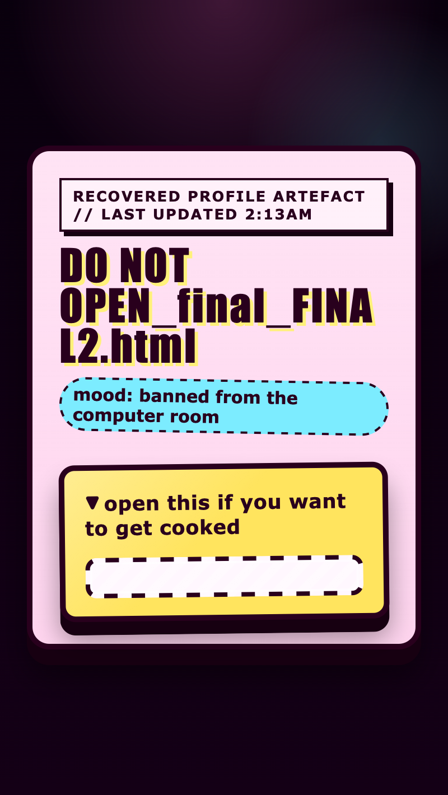

<h2 class="c-project-heading--task">Add the hidden panel</h2>

Add the inside box that appears when the artefact opens, then make it look messy and suspicious.

<h2 class="c-project-heading--explainer">Make these changes</h2>

Go back to `index.html` and add the hidden `<section>` inside the drawer.

This `<section class="inside">` is the panel that stays hidden until the drawer opens.

--- code ---
---
language: html
filename: index.html
line_numbers: true
line_number_start: 9
line_highlights: 16-17
---
    <main class="page">
      
Recovered profile artefact // last updated 2:13am

      <h1>DO NOT OPEN_final_FINAL2.html</h1>
      
mood: banned from the computer room

      

        
open this if you want to get cooked

        <section class="inside">
        </section>
      

    </main>
--- /code ---

Go back to `style.css` and add a new `.inside` rule underneath the comment at the bottom of the file.

This new rule comes later in the file, so it takes over and gives the inside panel its louder final styling.

<h3>Tip</h3>

`border-radius` can make the inside box feel more sticker-like or more sharp-edged.

`--inside-bg` can be pale peach, dirty white, washed-out cyan, or any other suspicious colour you chose in step 3.

This rule styles the inside panel that appears after opening. It adds the striped background, thicker border, and more space inside the hidden area.

--- code ---
---
language: css
filename: style.css
line_numbers: true
line_number_start: 128
line_highlights: 128-144
---
.inside {
  margin-top: 16px;
  padding: 14px 16px;
  border: 4px dashed var(--ink);
  border-radius: calc(var(--corner-size) - 4px);
  background:
    repeating-linear-gradient(
      -45deg,
      rgba(255, 255, 255, 0.4),
      rgba(255, 255, 255, 0.4) 8px,
      transparent 8px,
      transparent 16px
    ),
    var(--inside-bg);
  box-shadow: inset 0 0 0 2px rgba(255, 255, 255, 0.55);
  line-height: 1.7;
}
--- /code ---

Run your code and observe that opening the drawer now shows a bigger striped panel, even though it still has no text inside it yet.

## Now run your code

The drawer should now open to a messy-looking hidden panel that is ready for the final message.

  

