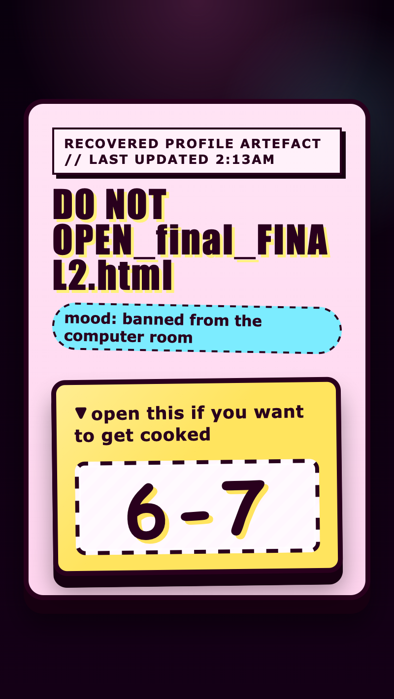

<h2 class="c-project-heading--task">Add the cursed message</h2>

Put the final `6-7` message inside the panel, then make it look huge and embarrassing.

<h2 class="c-project-heading--explainer">Make these changes</h2>

Go back to `index.html` and add the hidden message inside the panel.

This paragraph is the actual secret text inside the artefact. It stays hidden until the drawer opens.

--- code ---
---
language: html
filename: index.html
line_numbers: true
line_number_start: 9
line_highlights: 17-17
---
    <main class="page">
      
Recovered profile artefact // last updated 2:13am

      <h1>DO NOT OPEN_final_FINAL2.html</h1>
      
mood: banned from the computer room

      

        
open this if you want to get cooked

        <section class="inside">
          
6-7

        </section>
      

    </main>
--- /code ---

Go back to `style.css` and add a new `.inside p` rule underneath your new `.inside` rule.

Because this rule comes later in the file, it takes over from the tiny starter version and gives the message its final ugly look.

<h3>Tip</h3>

`text-shadow`, `font-size`, and `transform` can make the hidden message feel more ridiculous without changing the words.

Try a different bright shadow colour if you want the text to clash even more with the inside panel.

This rule only styles the hidden paragraph itself. It turns `6-7` into huge ugly text that is impossible to miss.

--- code ---
---
language: css
filename: style.css
line_numbers: true
line_number_start: 146
line_highlights: 146-156
---
.inside p {
  margin: 0;
  font-family: "Comic Sans MS", Impact, fantasy;
  font-size: clamp(4rem, 18vw, 7rem);
  font-weight: 900;
  line-height: 0.82;
  letter-spacing: 0.08em;
  text-align: center;
  text-shadow: 4px 4px 0 var(--drawer-open-bg);
  transform: rotate(-2deg);
}
--- /code ---

Run your code and observe that the hidden message now looks huge, warped, and deeply embarrassing.

## Now run your code

The inside panel should now feel much messier, and the hidden message should look huge and ugly when you open the drawer.

  

